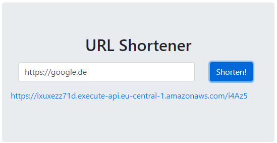
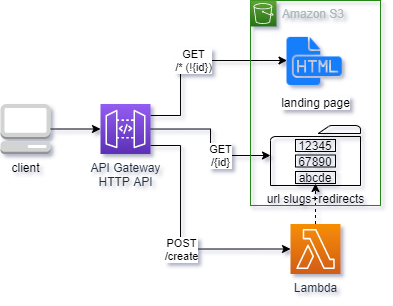
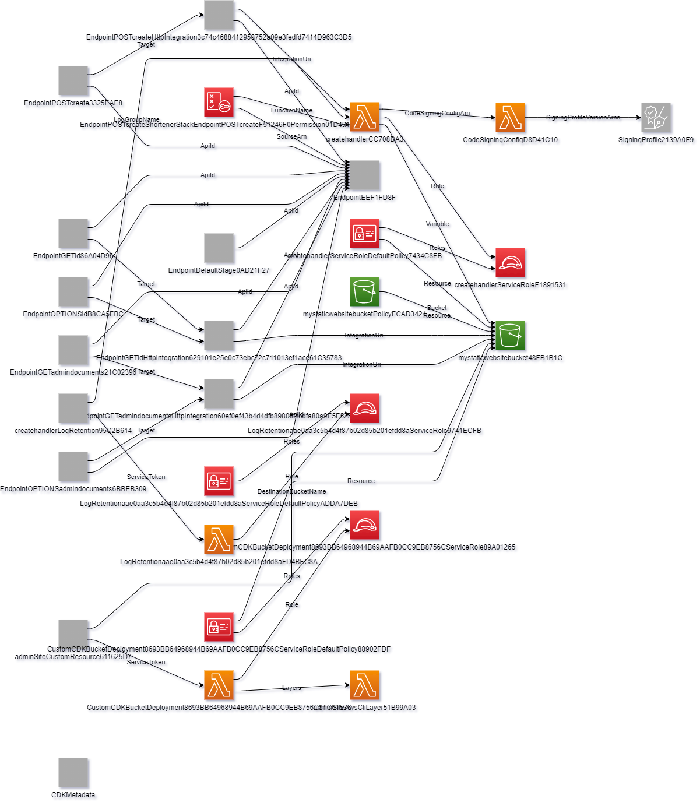

# Serverless Url Shortener [](https://github.com/LukvonStrom/cloud-serverless-url-shortener/actions/workflows/ci.yml)

This project is the implementation of the cloud computing programmatic assignment.

## Requirements
A website with the following functionality needs to be developed
### General Requirements
- [x] an arbitrary URL can be entered, the website will return a shortened URL
- [x] when the shortened URL is entered into the browser adressbar, a redirection happens
- [x] arbitrary URLs may be entered, the website returns unique shortened URLs
- [x] an invalid URL has to lead to an error
- [x] the website should return the shortened url in the following format: `http://{Servername/Localhost}/{URL-path}` the Path may only be 5 characters long.
### Framework conditions

- [x] the programming language is subject to the preferences of the implementer
- [x] the code must exist as a Git repository
- [x] a README.md has to be present, which guides users in setting up the shortener
- [ ] the website should be started as a docker container    
_This requirement is not fulfilled, as the lecturer agreed on accepting any cloud-native implementation as well._

### Testing requirements
These requirements need to be tested.
- [x] An invalid URL must produce an error
- [x] The URL-Path of the shortened URL must not be longer than five characters
- [x] at least two other unit tests have to be present
- [x] the README.md file describes how to execute the tests

## Architecture

In this [AWS Blog Entry](https://aws.amazon.com/de/blogs/compute/build-a-serverless-private-url-shortener/), Hadinger suggests a pragmatic solution to link shortening with Amazon S3.
He describes, that S3, or more specifically the built-in, toggleable webserver is able to redirect requests based on an object's metadata. Based on this property, it is possible to create objects with the `x-amz-website-redirect-location` metadata header, which will then redirect the request on this specific object to another target.

He envisions the following architecture in his post:

[](https://awscomputeblogimages.s3-us-west-2.amazonaws.com/urlshortener_diagram.png)

He builds out his architecture with a CloudFront CDN in front of both the required S3 Bucket.

--- 

Hadingers architecture was the starting point of this implementation, which follows a AWS CDK approach to deploying the required assets. Aditionally the CloudFront distribution was scrapped, in favor of the Amazon API Gateway HTTP API, which redirects the requests to S3. To serve the website, the error handler of the S3 Webserver was utilized. As there are only objects with 5 digits present, inputing any other character will lead to an internal S3 exception. By serving the `index.html` site as an error page, it will be shown any time, no redirect is performed (See also: https://stackoverflow.com/a/20273548).
The HTML page is really plain with only some JQuery code to perform the network request (If this were a frontend project I would've used react). 
    
The webinterface is proven to work with Chrome and Chromium Edge.

These decisions result in the following architecture:    



The infrastructure is described in its own AWS CDK stack at [`bin/shortener.ts`](../master/bin/shortener.ts) and [`lib/create-stack.ts`](../master/lib/create-stack.ts). The lambda function is implemented as a Node.js function, which is packaged by esbuild. It resides in [`lib/create-stack.create-handler.ts`](../master/lib/create-stack.create-handler.ts). The "Create" Logic resides in the `Slug` class in [`lib/create-slug.ts`](../master/lib/create-slug.ts). The HTML is located in [`lib/website/index.html`](../master/lib/website/index.html). 

To perform CI/CD, Github Actions is used. The corresponding `yaml` file is located at [`.github/workflows/ci.yml`](../master/.github/workflows/ci.yml) As the whole code depends on S3 for functionality, the CDK stack is deployed to a live AWS environment via Github and then the tests are performed. The `jest` test results are submitted in the junit format to Github for nicer display. This deviation from "unit testing" in itself towards a "integration testing" approach was approved by the lecturer.

## Useful commands

 * `npm run build`    
 compile typescript to js (nescessary to execute it with node.js)
 * `npm run test`    
 perform the jest unit tests (only after building)
 * `npm run cdk:bootstrap`    
 When deploying to the AWS account for the first time, use this command first. Otherwise this error appears: ```❌ ShortenerStack failed: Error: This stack uses assets, so the toolkit stack must be deployed to the environment (Run "cdk bootstrap aws://unknown-account/unknown-region")```
 * `npm run deploy`    
 deploy this stack to your default AWS account/region (only after building)
 * `npm run cdk:diff`    
 compare deployed stack with current state
 * `npm run cdk:synth`    
 emits the synthesized CloudFormation template

 ## Prod environment:
 The productive environment, wo which the CICD pipeline points is hosted at: [https://ixuxezz71d.execute-api.eu-central-1.amazonaws.com/](https://ixuxezz71d.execute-api.eu-central-1.amazonaws.com/)

 ## Generated Architecture Image
 Below you'll find an automagically generated architecture image, which is generated from the whole CDK stack.




## Sources
**Hadinger, S. (2016):** Build a Serverless, Private URL Shortener, [https://aws.amazon.com/de/blogs/compute/build-a-serverless-private-url-shortener/](https://aws.amazon.com/de/blogs/compute/build-a-serverless-private-url-shortener/), Retrieved: 26.05.2021